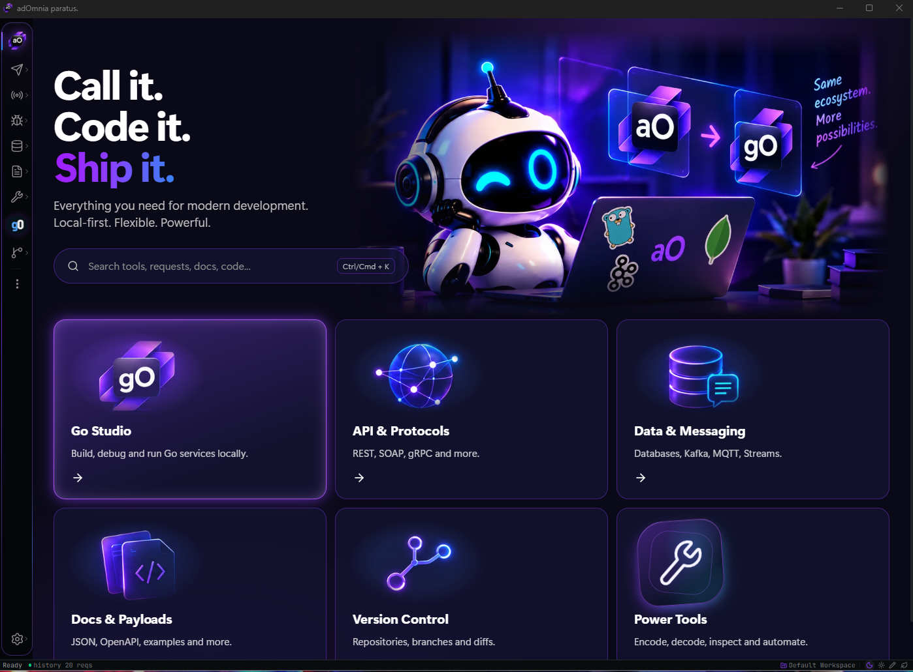
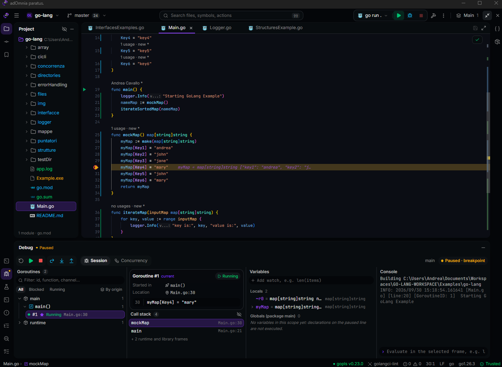
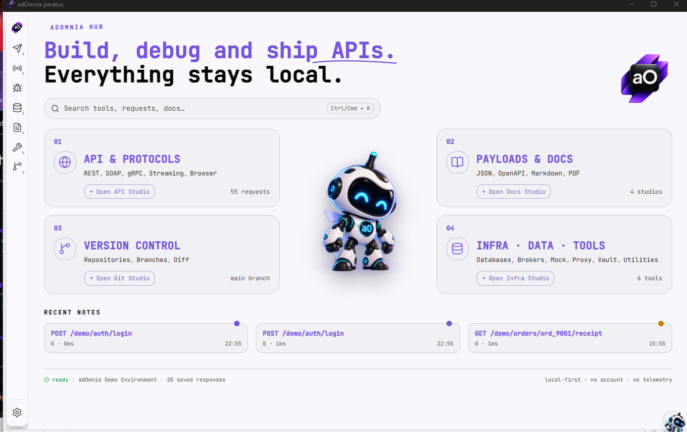
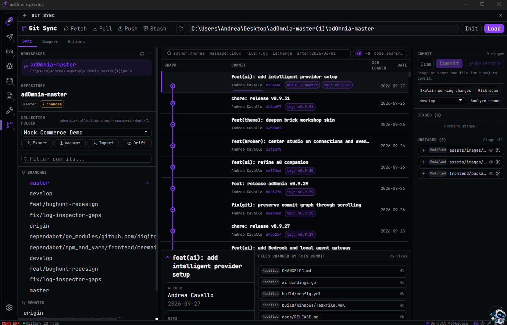

# adOmnia


adOmnia is a local-first desktop application for API development and debugging, with an integrated Go IDE.

It combines an API client (REST, GraphQL, SOAP, gRPC, WebSocket, SSE), message broker clients, a mock server, an intercepting proxy, browser debugging, log analysis, database explorers and a Git client in a single workspace. **gO Studio**, the built-in Go IDE, adds editing with gopls, Delve debugging, tests, coverage and an integrated terminal.

adOmnia runs on Windows, macOS and Linux. It requires no account and collects no telemetry. Workspace data is stored locally; AI features are optional and connect only to the provider you configure.

[](https://github.com/Andrea-Cavallo/adOmnia/releases/latest)
[](https://github.com/Andrea-Cavallo/adOmnia/actions/workflows/build.yml)
[](LICENSE.md)
[](https://www.adomnia-dev.com)

[Download](#download) · [Features](#features) · [Workflows](#workflows) · [gO Studio](#go-studio) · [AI](#ai) · [CLI](#command-line-and-ci) · [Building from source](#building-from-source) · [Documentation](#documentation)



## Download

Download the latest build from **[GitHub Releases](https://github.com/Andrea-Cavallo/adOmnia/releases/latest)**.

| Platform | Artifact | Requirements |
| --- | --- | --- |
| Windows x64 | `adomnia-<version>-windows-amd64.exe` | WebView2 runtime |
| macOS (Intel and Apple Silicon) | `adomnia-<version>-macos-universal.dmg` | — |
| Linux x64 | `adomnia-<version>-linux-amd64-gtk3-webkitgtk-4.1.tar.gz` | GTK 3, WebKitGTK 4.1 |

Each release includes `SHA256SUMS.txt`. See the [installation guide](docs/INSTALL.md) for platform-specific steps.

### Sending a first request

1. Open **API Workspace** and create a **New Request**, either at workspace root or inside a collection.
2. Choose the method, enter the URL and set headers, authentication and body as needed.
3. Send the request and review status, timing, headers, body and assertion results.
4. Optionally create an Environment for `{{variables}}`, or import a Postman collection, cURL command or OpenAPI document.

## Features

| Area | Summary |
| --- | --- |
| **API client** | REST and GraphQL requests, environments and variables, authentication (OAuth 2.0, AWS Signature v4, Digest and others), pre/post scripts, assertions, response history, code generation, Postman/cURL/OpenAPI import, OpenAPI editor with governance rules. |
| **Testing and flows** | Collection runner with CSV datasets, recorded or AI-assisted flows, variables extracted from responses, failure branches, contract checks, and flow load tests with latency, throughput and APDEX thresholds. |
| **Protocols and brokers** | SOAP/WSDL with WS-Security, gRPC (including streaming), WebSocket, SSE, Kafka, RabbitMQ, MQTT, Redis Pub/Sub and NATS. |
| **Mocking and traffic** | Schema-based mock responses, conditional expectations, record/replay, HTTPS interception, breakpoints, map local/remote, throttling, HTTP/gRPC load testing and a local Docker lab. |
| **Debugging** | Browser debugging via the Chrome DevTools Protocol, application log inspector, HAR viewer, network diagnostics, payload utilities and redacted evidence export. |
| **Data and documents** | SQLite, PostgreSQL, MySQL and MongoDB explorers; Markdown, Mermaid and LaTeX editing; PDF annotation, forms and digital signatures. |
| **Git** | Clone and init, staging, commits, history graph, branches, merge, push/pull, diff, conflict resolution, and collection export to a reviewable folder layout. |
| **Go development** | gO Studio: see [below](#go-studio). |
| **AI and MCP** | Optional cloud or local models, the a0 assistant, a local agent gateway, an MCP client/debugger and an MCP server generator. |
| **Security and customization** | Encrypted vault, private environments, mTLS with PEM and JKS keystores, certificate tools, JavaScript plugins, templates and themes. |

The [feature catalog](docs/adomnia-feature-catalog.en.md) lists every module in detail. Current status and open work are tracked in [docs/ISSUES.md](docs/ISSUES.md).

## Workflows

### Recording a flow

Press **Record**, send requests from the Composer, then stop recording. The sequence becomes an editable flow: map response values into later requests, add assertions and recovery branches, generate a Mermaid diagram and replay it.


### Mocking the current request

**Mock this tab** configures the open request as an endpoint in the Mock Server. Existing mock definitions are kept; the view stays focused on the selected endpoint until **Show all endpoints** is chosen. If the server is already running, it picks up the change without a restart or port change.

The Traffic view shows which response was served for each call, or why a call did not match (missing route, authentication failure, CORS preflight).

### Investigating logs

Load log files, paste output, or attach `kubectl`, `oc` and Docker log streams. The Log Inspector places events on a timeline, pairs request and response payloads and groups recurring errors. It accepts structured queries:

```text
duration_ms > 1000 AND (status = 500 OR status = 502)
```

Investigations can be saved with their queries, layout, bookmarks and notes. Individual calls can be exported as redacted evidence or converted into a request, flow or mock. Large files are indexed on disk and paginated.


### Versioning collections with Git

**Git Sync → Collection Folder** exports a collection to a deterministic folder layout, imports it back, and reports differences between the app and the files on disk:

```text
my-collection/
├── adomnia.collection.json
├── collection.json
├── folders/
│   ├── 001-auth/
│   │   ├── folder.json
│   │   └── 001-login.request.json
│   └── 002-users/
│       └── 001-list-users.request.json
└── .adomnia-sync.json
```

Collection and folder settings can define shared authentication, headers, variables and scripts.

## gO Studio

The current Go Studio workspace below shows the Project view, editor actions and
Run console that live alongside the API tools in the same local desktop app.



gO Studio is the Go IDE built into adOmnia.

- **Editing:** completion, navigation, refactoring and diagnostics via gopls; golangci-lint and staticcheck integration.
- **Run and test:** build and run from the gutter next to `func main`, run tests with coverage, run Makefile targets, Dockerfiles and docker compose services.
- **Debugging:** Delve with conditional, hit-count and function breakpoints, logpoints, stop on panic and Run to Cursor.
- **Toolchain:** uses the project's Go SDK, detected locally or installed from the official distribution; per-project `GOPROXY`, `GOPRIVATE`, `CGO_ENABLED`, `GOOS`/`GOARCH` and build tags.
- **Integration:** Git in the editor, an integrated terminal, and shortcuts to the Docker Lab, database and broker tools for services declared in `go.mod`.

**Trust model.** A newly opened project can be browsed and edited, but no Go tool runs against it until it is explicitly trusted. Multiple projects can be open side by side, each isolated, and any of them can be moved to a separate window.

**Fix with AI** sends the relevant code to the configured AI provider and shows the proposed change as a diff for review before it is applied.

See the [gO Studio guide](docs/GO-STUDIO.md) for trust rules, optional tools, storage and keyboard shortcuts.

## AI

AI features are optional and disabled until a provider is configured in **Settings → AI Engine**. The a0 assistant becomes available once the selected provider and model pass **Test connection**.

Supported providers: Anthropic, Amazon Bedrock, OpenAI, Google Gemini, DeepSeek, Hugging Face, Ollama and OpenAI-compatible endpoints.

### Credentials

API keys are resolved from process environment variables, adOmnia environments or `.env` files, with the encrypted vault as fallback:

| Provider | Variables |
| --- | --- |
| Anthropic | `ANTHROPIC_API_KEY` |
| OpenAI | `OPENAI_API_KEY` |
| Google Gemini | `GEMINI_API_KEY`, `GOOGLE_API_KEY` |
| DeepSeek | `DEEPSEEK_API_KEY` |
| Hugging Face | `HUGGINGFACE_API_KEY`, `HF_TOKEN` |
| OpenAI-compatible | `OPENAI_COMPATIBLE_API_KEY`, `OPENAI_API_KEY` |

`ADOMNIA_AI_API_KEY` is used as a generic fallback. Amazon Bedrock uses the standard AWS SDK credential chain (environment, shared profiles, IAM Identity Center/SSO, workload identity). On Windows, restart adOmnia after changing environment variables.

### Agent actions

When **Agent actions** is enabled (off by default), a0 can create request definitions at workspace root from explicit instructions in chat. Created requests open for review and are not sent automatically. The action currently supports name, method, URL, headers and an optional body.

## Data and privacy

- No account, no telemetry, no automatic cloud sync.
- Editing and inspection work offline; network traffic goes only to endpoints you call.
- Cloud AI providers receive the prompt and the workspace context you supply. Ollama or another local endpoint keeps inference on your machine.
- Local storage is not encrypted by default. Store secrets in the **encrypted vault**. Environments marked **Private** are excluded from exports, and exported public environments replace secret values with empty placeholders.

## Command line and CI

The desktop executable also provides headless commands. Examples below assume `adomnia` is on your `PATH`.

### Running a collection

```bash
adomnia run ./my-collection --env prod --folder "Smoke" --reporter junit --out report.xml --bail
```

Supports environment overrides, assertions, sandboxed scripts and CLI, JSON or JUnit reports. Failed requests or assertions return a non-zero exit code.

### Load-testing a flow

Export a **CI plan** from the Flow Stress panel, then run it:

```bash
adomnia stress ./checkout.stress.json --dataset users.csv --env-var BASE_URL=https://staging.example.com --reporter junit --out stress.xml
```

Exit code `1` means a request or performance threshold failed; `2` means the plan is invalid.

### Linting OpenAPI

```bash
adomnia lint ./openapi.yaml --reporter json --out lint-report.json
adomnia lint ./my-collection --ruleset adomnia.oaslint.json --fail-on-warn
```

The same rules are available under **API Docs → Governance**. Errors fail the command; warnings fail it only with `--fail-on-warn`.

<details>
<summary>Environments and credentials in headless runs</summary>

- `--env <name>` loads `environments/<name>.json`; `--env-var KEY=VALUE` overrides a single variable.
- Precedence: collection variables, collection `.env`, named environment, CLI overrides.
- Supported: non-interactive OAuth grants, AWS Signature v4, a per-run cookie jar and multipart file uploads.
- Interactive OAuth (authorization code/PKCE) requires the desktop app; use a refresh token or a non-interactive grant in CI.
- Vault references are resolved from `ADOMNIA_VAULT_<VARIABLE_NAME>` environment variables. The runner does not decrypt exported vault data.

</details>

## Screenshots

<details>
<summary>Light theme, Sketch theme, Hub, Git and Power Tools</summary>







</details>

## Building from source

adOmnia is built with Go, Wails 3, React and TypeScript. Requirements: Go 1.26.5, Node.js 22.13.0 or later, the Wails 3 CLI and the platform WebView development packages.

```bash
git clone https://github.com/Andrea-Cavallo/adOmnia.git
cd adOmnia
go install github.com/wailsapp/wails/v3/cmd/wails3@v3.0.0-beta.25
npm --prefix frontend ci
wails3 task dev
```

Production build and packaging:

```bash
wails3 task build
wails3 task package
```

Checks (build the frontend first; the Go binary embeds its assets):

```bash
npm --prefix frontend test
npm --prefix frontend run build
npm --prefix frontend run check:startup
go build ./...
go test ./...
```

On Linux, builds use the GTK 3 build tag. See the [build guide](docs/BUILD.md) for native dependencies, per-platform commands and release metadata.

## Documentation

| Document | Contents |
| --- | --- |
| [Installation](docs/INSTALL.md) | Downloads and platform setup |
| [Build](docs/BUILD.md) | Toolchain, native dependencies, packaging |
| [Feature catalog](docs/adomnia-feature-catalog.en.md) | Module-by-module reference |
| [gO Studio](docs/GO-STUDIO.md) | Go IDE usage, trust model, tools, shortcuts |
| [FAQ](docs/FAQ.md) | Common questions |
| [Troubleshooting](docs/TROUBLESHOOTING.md) | Diagnostics and recovery |
| [Architecture](docs/ARCHITECTURE.md) | Application structure |
| [Startup performance](docs/PERFORMANCE.md) | Loading strategy and bundle budget |
| [Changelog](CHANGELOG.md) | Changes by version |
| [Release process](docs/RELEASE.md) | Release notes and publishing |

## Contributing

Report bugs and propose changes through [GitHub Issues](https://github.com/Andrea-Cavallo/adOmnia/issues). Include the app version, operating system and steps to reproduce, and remove credentials or private data from examples.

Before submitting code, read [AGENTS.md](AGENTS.md) and [CLAUDE.md](CLAUDE.md), follow the conventions of the module you are changing and describe how you verified the change. Report security vulnerabilities privately as described in the [security policy](.github/SECURITY.md).

## Acknowledgements

Thanks to [albertize](https://github.com/albertize) and [plunix](https://github.com/plunix) for their contributions.

## License

[MIT](LICENSE.md). Copyright © 2026 adOmnia Contributors.
